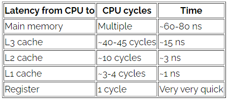
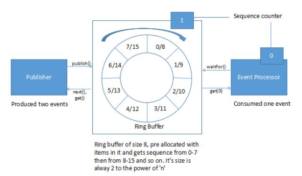

## Simultaneidade com LMAX Disruptor - Uma Introdução

# 1. Visão Geral
Este artigo apresenta o LMAX Disruptor e fala sobre como ele ajuda a alcançar a simultaneidade de software com baixa latência. Também veremos um uso básico da biblioteca Disruptor.

# 2. O que é um disruptor?
Disruptor é uma biblioteca Java de código aberto escrita por LMAX. É uma estrutura de programação concorrente para o processamento de um grande número de transações, com baixa latência (e sem as complexidades do código concorrente). A otimização do desempenho é alcançada por um design de software que explora a eficiência do hardware subjacente.

### 2.1. Simpatia Mecânica
Vamos começar com o conceito central de simpatia mecânica - trata-se de entender como o hardware subjacente opera e programar da maneira que melhor funciona com esse hardware.

Por exemplo, vamos ver como a organização da CPU e da memória pode afetar o desempenho do software. A CPU possui várias camadas de cache entre ela e a memória principal. Quando a CPU está realizando uma operação, ela primeiro procura os dados em L1, depois em L2, em L3 e, por fim, na memória principal. Quanto mais longe, mais tempo demorará a operação.

Se a mesma operação for executada em um dado várias vezes (por exemplo, um contador de loop), faz sentido carregar esses dados em um local muito próximo da CPU.

Alguns números indicativos para o custo de perdas de cache:


     
### 2.2. Por que não filas
As implementações de fila tendem a ter contenção de gravação nas variáveis ​​de início, fim e tamanho. Normalmente, as filas estão sempre quase cheias ou quase vazias devido às diferenças de ritmo entre consumidores e produtores. Eles muito raramente operam em um meio-termo equilibrado, onde a taxa de produção e consumo são equilibradas.

Para lidar com a contenção de gravação, uma fila geralmente usa bloqueios, o que pode causar uma mudança de contexto para o kernel. Quando isso acontece, o processador envolvido provavelmente perderá os dados em seus caches.

Para obter o melhor comportamento de cache, o design deve ter apenas um núcleo de gravação em qualquer local da memória (vários leitores são adequados, pois os processadores geralmente usam links especiais de alta velocidade entre seus caches). As filas falham no princípio de um gravador.

Se duas threads separadas estão gravando em dois valores diferentes, cada núcleo invalida a linha de cache do outro (os dados são transferidos entre a memória principal e o cache em blocos de tamanho fixo, chamados de linhas de cache). Essa é uma contenção de gravação entre os dois threads, embora eles estejam gravando em duas variáveis diferentes. Isso é chamado de falso compartilhamento, porque toda vez que a cabeça é acessada, a cauda também é acessada e vice-versa. 
     
### 2.3. Como funciona o disruptor


          
O disruptor tem uma estrutura de dados circular baseada em array (buffer em anel). É uma matriz que possui um ponteiro para o próximo slot disponível. Ele é preenchido com objetos de transferência pré-alocados. Os produtores e consumidores executam a gravação e a leitura dos dados no anel sem travamento ou contenção.

Em um Disruptor, todos os eventos são publicados para todos os consumidores (multicast), para consumo paralelo por meio de filas downstream separadas. Devido ao processamento paralelo pelos consumidores, é necessário coordenar as dependências entre os consumidores (gráfico de dependências).

Os produtores e consumidores têm um contador de sequência para indicar em qual slot do buffer ele está trabalhando no momento. Cada produtor / consumidor pode escrever seu próprio contador de sequência, mas pode ler os contadores de sequência de outros. Os produtores e consumidores leem os contadores para garantir que o slot que deseja gravar esteja disponível sem bloqueios.

# 3. Usando a Biblioteca Disruptor
### 3.1. Dependência Maven
Vamos começar adicionando a dependência da biblioteca Disruptor em pom.xml:      
```
<dependency>
    <groupId>com.lmax</groupId>
    <artifactId>disruptor</artifactId>
    <version>3.3.6</version>
</dependency>          
```
### 3.2. Definindo um Evento
Vamos definir o evento que carrega os dados:

 ```
 public static class ValueEvent {
    private int value;
    public final static EventFactory EVENT_FACTORY 
      = () -> new ValueEvent();

    // standard getters and setters
}         
 ```
 A EventFactory permite que o Disruptor pré-aloque os eventos.
 
### 3.3. Consumidor
Os consumidores leem dados do buffer de anel. Vamos definir um consumidor que tratará dos eventos:

```
public class SingleEventPrintConsumer {
    ...

    public EventHandler<ValueEvent>[] getEventHandler() {
        EventHandler<ValueEvent> eventHandler 
          = (event, sequence, endOfBatch) 
            -> print(event.getValue(), sequence);
        return new EventHandler[] { eventHandler };
    }
 
    private void print(int id, long sequenceId) {
        logger.info("Id is " + id 
          + " sequence id that was used is " + sequenceId);
    }
}
```

Em nosso exemplo, o consumidor está apenas imprimindo em um log.

### 3.4. Construindo o disruptor
Construa o disruptor:

```
ThreadFactory threadFactory = DaemonThreadFactory.INSTANCE;

WaitStrategy waitStrategy = new BusySpinWaitStrategy();
Disruptor<ValueEvent> disruptor 
  = new Disruptor<>(
    ValueEvent.EVENT_FACTORY, 
    16, 
    threadFactory, 
    ProducerType.SINGLE, 
    waitStrategy);
```

No construtor do Disruptor, são definidos os seguintes:

- Event Factory - Responsável por gerar objetos que serão armazenados no ring buffer durante a inicialização;
- O tamanho do buffer de anel - Definimos 16 como o tamanho do buffer de anel. Tem que ser uma potência de 2, caso contrário, lançaria uma exceção durante a inicialização. Isso é importante porque é fácil realizar a maioria das operações usando operadores binários lógicos, por exemplo, operação mod
- Thread Factory - Factory para criar threads para processadores de eventos;
- Tipo de produtor - especifica se teremos um ou vários produtores;
- Estratégia de espera - define como gostaríamos de lidar com assinantes lentos que não acompanham o ritmo do produtor.

Conecte o gerenciador do consumidor:

```
disruptor.handleEventsWith(getEventHandler());
```

É possível fornecer Disruptor a vários consumidores para lidar com os dados produzidos pelo produtor. No exemplo acima, temos apenas um manipulador de eventos de consumidor a.k.a.

### 3.5. Iniciando o disruptor
Para iniciar o disruptor:

```
RingBuffer<ValueEvent> ringBuffer = disruptor.start();
```

3.6. Produção e publicação de eventos
Os produtores colocam os dados no buffer de anel em uma sequência. Os produtores precisam estar cientes do próximo slot disponível para não sobrescrever os dados que ainda não foram consumidos.

Use o RingBuffer do Disruptor para publicar:

```
for (int eventCount = 0; eventCount < 32; eventCount++) {
    long sequenceId = ringBuffer.next();
    ValueEvent valueEvent = ringBuffer.get(sequenceId);
    valueEvent.setValue(eventCount);
    ringBuffer.publish(sequenceId);
}
```

Aqui, o produtor está produzindo e publicando itens em sequência. É importante observar aqui que o Disruptor funciona de maneira semelhante ao protocolo 2 phase commit. Ele lê um novo sequenceId e o publica. Na próxima vez, ele deve obter sequenceId + 1 como o próximo sequenceId.

# 4. Conclusão
Neste tutorial, vimos o que é um Disruptor e como ele atinge a simultaneidade com baixa latência. Vimos o conceito de simpatia mecânica e como ela pode ser explorada para atingir baixa latência. Vimos então um exemplo usando a biblioteca Disruptor.    
  
          
 
